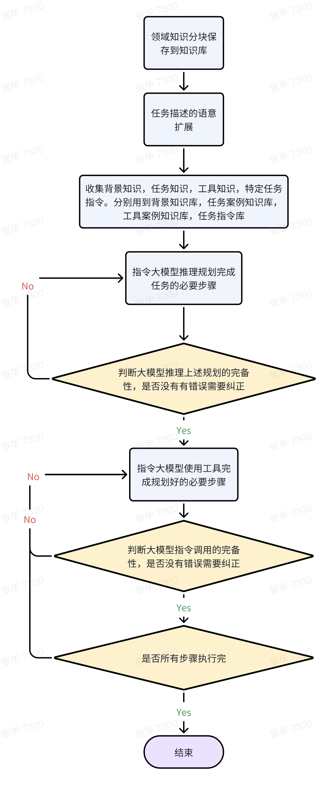

# 羚数AI介绍
羚数智能 基于书生浦语 高端装备制造业 产销研一体化 AI Agent

## 项目背景介绍

高端装备制造行业是我国重点发展的制造产业，也是国家国产替代战略发展的主力军。以民用航空航天、能源装备、船舶及海洋工程装备等行业为代表的装备制造业高速发展，2024年产值规模预计接近40万亿元，规模以上企业10.51万家。

### 装备制造企业主要特点
- 全球化的跨国采销体系管理：跨国原材料、零部件采购需要大量沟通与追踪工作，企业内外部年度需要跟踪的订单多达数万个。
- 高端化的自主设计制造产品：“首台套”、重点项目装备设计制造周期长达数月至数年，项目制生产过程中严格的工程协同成为ETO模式管理难点。
- 集团化的大型企业内部协同：多层级的组织架构与部门设置，跨地区与业务环节之间的协同与沟通工作占据大量工作时间，拉低效率。
- 离散化的企业数字系统基础：PLM、ERP、MES、WMS、SCM等众多系统数据分散，系统间交互、数据应用需要大量的代码开发工作。
- 专业化的制造管理知识传承：装备制造业需要对知识的高度积累，指导生产经营，产品设计，促进产品的改造、转型和升级。

### 以某国家级龙头企业案例为例
该客户是我国研究、设计、制造大型发电设备的重大技术装备制造骨干企业，是全球发电设备、清洁能源产品和服务的主要供应商。实际生产过程项目管理现状如下：
- 年度工程变更任务数 12000+
- 单次变更执行时长 30+小时
- 单次变更涉及人数 50-200人
- 单项目变更成本 千万级


## 在产品制造过程中的挑战
有大量工程技术变更执行层工作，传统线下管理方式面临以下难点：
- 项目工程变更或技术通知单难以精准的传递给相关人员
- 车间及采购需要接受大量单据并人工甄别
- 变更及通知单的影响范围缺乏有效的评估、记录及管理
- 技术变更后生产订单未及时变更导致不同步
- 变更及通知单执行均在线下完成，导致技术变更及业务协同性差
- 多部门信息不同步，有时甚至会引起质量问题或对生产造成影响

### 解决方案与应用价值
羚数智能基于InternLM2 20B 模型，开发产销研一体化 AI Agent 的产品，具有以下应用价值：
- 平均单个制造项目 500-2000 项变更任务，年均处理 10000+变更任务，显著优化人力资源。
- 企业内外至少涉及 5 大业务部门，解决ETO项目进度协同的管理难题。
- 每年能为客户企业节省 数百万 成本，大幅提升产品交付效率。

## 功能描述
羚数产销研一体化 AI Agent 经过充分的领域适应的in-context learning和有监督微调训练，打通了从传统制造业知识到智能体可用知识的桥梁。通过制造、工艺、设计等行业知识的深入学习，大量专业经验以及海量工艺设计变更实例的深入理解，已经发展出一种超越传统专家水平的业务能力。

### 主要功能
- 积累的制造业领域知识
- 通过RAG扩展用户的变更需求
- 指令书生浦语2-20B大模型完成关联变更的推理、规划、验证
- 通过相关信息系统接口自动执行相关变更，替代人工操作

## 架构图


## 搭建方法

下载开源工具包和模型:

```bash
git clone https://github.com/lm-sys/FastChat.git
git clone https://www.modelscope.cn/Xorbits/bge-m3.git
git clone https://www.modelscope.cn/Shanghai_AI_Laboratory/internlm2-chat-20b.git
```
安装/启动Qdrant向量数据库：

```bash
pip install qdrant-client
docker pull qdrant/qdrant
docker run -p 6333:6333 \
    -v $(pwd)/qdrant_storage:/qdrant/storage:z \
    qdrant/qdrant
```

安装langchain，flask等开发工具（用于agent流程和服务开发。
```bash
pip3 install langchain
pip3 install langchain-openai
pip3 install flask
```

安装依赖包（部署模型用）：
```bash
cd FastChat
pip3 install -e .
pip3 install -e ".[model_worker,webui]"
pip3 install einops
pip3 install flash-attn
pip3 install types-chardet
pip3 install chardet
pip3 install packaging
```

启动部署控制服务：
```bash
tmux new -s cont
python3 -m fastchat.serve.controller --host 0.0.0.0
```
启动书生2.0，20B的LLM模型服务：
```bash
tmux new -s mod
CUDA_VISIBLE_DEVICES=0 python3 -m fastchat.serve.model_worker --model-path ../internlm2-chat-20b --load-8bit --controller http://localhost:21001 --host 0.0.0.0 --port 31011 --worker http://localhost:31011
```
启动embedding模型服务：

```bash
tmux new -s bge-m3
python3 -m fastchat.serve.model_worker --model-path ../bge-m3 --controller http://localhost:21001 --host 0.0.0.0 --port 31031 --worker http://localhost:31031
```

启动对话界面服务：
```bash
tmux new -s radio
python3 -m fastchat.serve.gradio_web_server --host 0.0.0.0  --port 8901
```

启动API服务：
```bash
tmux new -s api
python3 -m fastchat.serve.openai_api_server --host 0.0.0.0 --port 8902
```


## 产品演示说明
输入项目工程变更内容或需求

Agent 接收变更内容描述，自然语义解析理解变更内容，并通过向量点积距离与向量数据库匹配相似的知识

Agent开始输出变更影响的范围，以及处理该变更关联的变更项和待执行任务

针对输出的结果，Agent会进行反思纠错，重复此过程，直到Agent调用符合要求或者达到重试次数的上限

Agent反思纠错确认规划无误，则页面输出变更执行涉及的部门、所需要执行的任务内容、变更同步所需要的接口及参数，输出执行指令


操作人员确认输出结果，回复执行或者确认等指令，Agent则自动执行任务、触发相关接口数据同步


## 技术说明
场景难点主要有
- 技术变更数量众多（单企业每年12000+次）
- 涉及5个以上部门和人员
- 协调执行时间长等问题

需要从技术方案上确保准确识别变更影响范围，规划关联变更，实时同步多部门系统数据，快速执行变更任务。
目前，随着大模型的能力涌现所展现的推理能力、规划能力、数学逻辑能力、写作能力、常识理解能力、专业领域的理解能力等，使其成为关键有效的技术手段。

同时 AI 智能体技术依托大语言模型的推理和规划能力，可自主闭环规划解决方案，自主调用工具完成复杂任务。而且，智能体从方案设计上避免了大模型的幻觉，应答不稳定，并扩展了执行能力。

传统智能体方案多采用固定的指令引导大模型完成任务规划，结果验证和工具调用。对于常见问题，经过优化的指令可以较高的完成度帮助用户。但对于不常见任务，如技术变更这种专业领域的任务拆解和规划则体现出知识不足，概念不清晰，方案不符合专业要求等问题，导致任务失败。人工调试指令只能解决个别案例，且成本高昂，无法达成高效自动的目标。

羚数 AI 智能体解决方案采用自动获取领域知识（包括变更流程，概念，背景知识，变更规划案例，变更执行同步案例等）。针对不同任务，动态构造指令、选取合适的大模型、大模型参数配置。完成变更任务规划、结果验证、变更任务执行，工具自动调用。

离线知识库准备：10+ 头部装备制造业客户数据，设计（变更）描述文件 540 份，工艺（变更）描述文件 840 份，行业专家输出，专业术语描述字典总计 1000 + 条。知识库拆解成相对独立的知识块（记忆片段）后通过大模型转换成embedding，保存在向量知识库中。

- 步骤1: 利用 RAG 拓展用户输入的任务描述背景知识和记忆，拓展后的输入包含更多相关领域信息，更详细的专业术语解释。拓展后的任务更有利于大模型理解、分析和推理。

- 步骤2: 针对给定任务，添加思维链（CoT）指令。针对in-context learning，动态采样few-shot样本，采用RAG从知识库中获取。调用特定参数配置（比如不同的temperature，top_p，max_tokens, frequency_penalty 等）的大模型，完成推理，规划关联变更，并生成JSON解析格式的结果。
image
- 步骤3: 拼接上一步任务规划指令和规划结果，通过引入特殊设计的CoT结果反思指令，要求大模型反思规划结果的完备性，分析规划结果合理性，确定结果是否满足规划要求，JSON格式和目标是否一致。

- 步骤4: 针对每一项变更，调用大模型产生每一个变更执行所需要同步的内容。同样针对in-context learning，动态采样few-shot样本，利用RAG从知识库中获取执行同步所需要的信息。添加思维链指令，要求大模型分析变更同步所需要的接口及参数，产生结构化变更调用指令，输出执行指令模版。

- 步骤5: 部分变更待人工确认后，变更任务交给大模型生成特定工具（系统）的自动执行脚本，相关系统PLM、APS、SRM、MES信息同步更新。变更完成，闭环落地。



## 特别说明
1. 关于训练数据，由于训练数据属于客户内部管理文件，涉及企业核心机密，故不便于公开上传
2. 关于产品源代码，本产品涉及大量原创知识产权，故不便于公开上传

请评委理解，谢谢


## 启动文件
start.sh

```bash
lmdeploy serve api_server /llm/model/internlm2-chat-20b --server-port 23333 --tp 2

## 视频简介
[](http://static.leadigital.net/video/ld-ai-agent.mp4)
```